# Praktikum 2 - HTML Lanjutan

Repository ini berisi hasil pengerjaan Praktikum 2 Pemrograman Web tentang HTML Lanjutan.

## Identitas

- Nama: M. Fahmi Abdul Basith
- NIM: 312510260
- Program Studi: Teknik Informatika
- Mata Kuliah: Pemrograman Web
- Praktikum: 2 - HTML Lanjutan

---

## Tujuan Praktikum

Praktikum ini bertujuan untuk mempelajari:

1. Penggunaan tabel pada HTML.
2. Penggunaan form dan berbagai jenis input HTML.
3. Penggunaan Semantic HTML.
4. Penambahan elemen multimedia.
5. Validasi form dasar menggunakan atribut HTML.

---

## 1. Membuat Tabel Data Mahasiswa

Pada praktikum ini dibuat tabel untuk menampilkan data mahasiswa menggunakan elemen:

- `<table>`
- `<tr>`
- `<th>`
- `<td>`

Contoh data yang ditampilkan adalah NIM, Nama, dan Program Studi.

### Screenshot di VS code

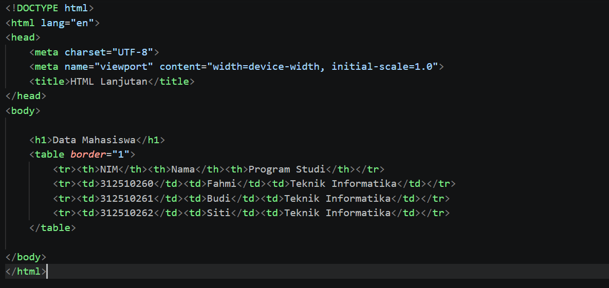

### Screenshot Hasil di Browser

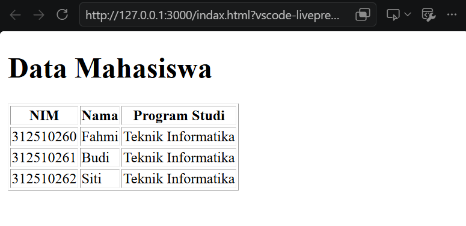

---

## 2. Mengembangkan Tabel

Tabel dikembangkan menggunakan:

- `<caption>`
- `<thead>`
- `<tbody>`
- `<tfoot>`
- `colspan`

### Screenshot di VS code

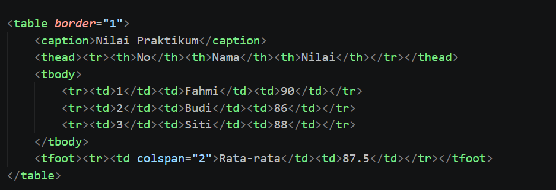

### Screenshot Hasil di Browser

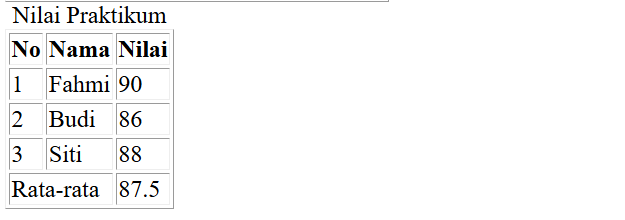

---

## 3. Membuat Form Registrasi Mahasiswa

Form digunakan untuk menerima data dari pengguna.

Input yang digunakan:

- Nama
- Email
- Password
- Tanggal Lahir
- Tombol Daftar
- Tombol Reset

### Screenshot di VS code

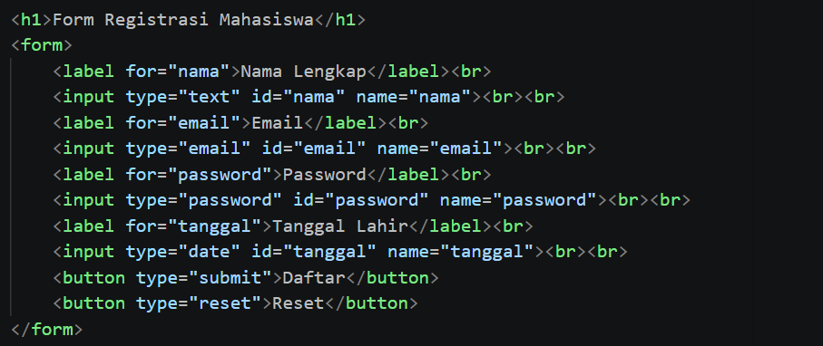

### Screenshot Hasil di Browser

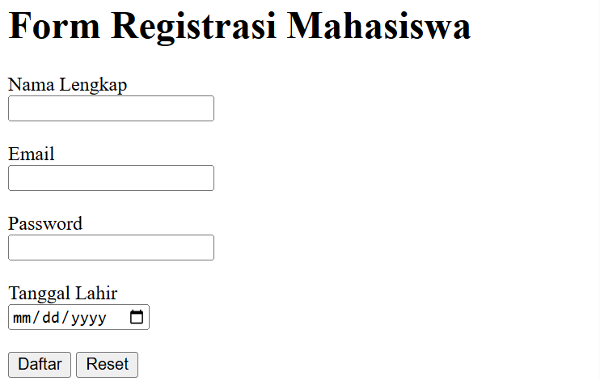

---

## 4. Radio Button dan Checkbox

Radio button digunakan untuk memilih satu pilihan, sedangkan checkbox digunakan untuk memilih satu atau beberapa pilihan.

Contoh:

- Jenis Kelamin
- Keahlian HTML
- Keahlian CSS
- Keahlian JavaScript

### Screenshot di VS code

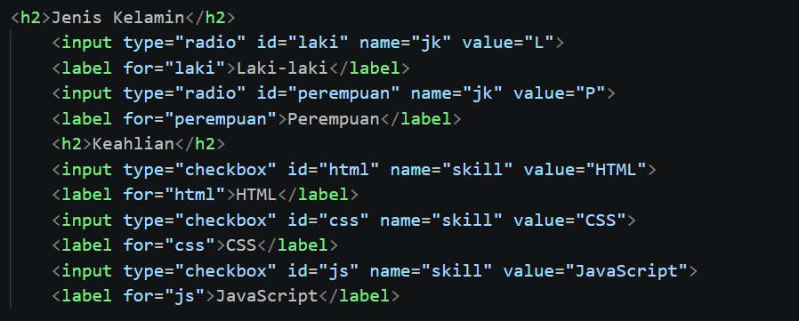

### Screenshot Hasil di Browser

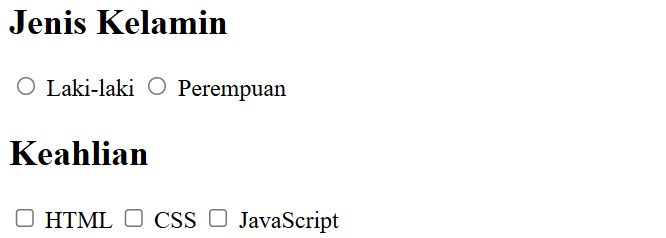

---

## 5. Select dan Textarea

Pada latihan ini digunakan:

- `<select>` untuk memilih Program Studi.
- `<textarea>` untuk memasukkan Alamat.

### Screenshot di VS code

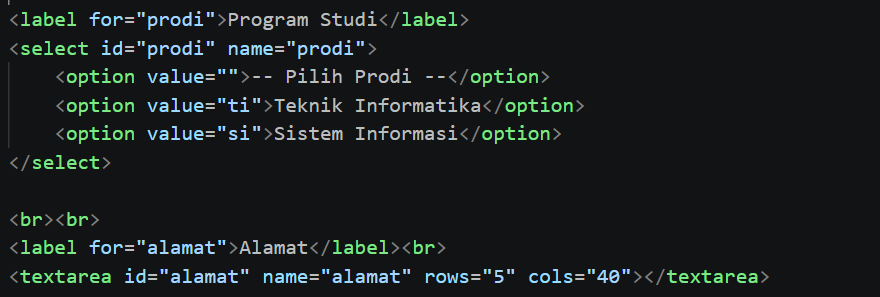

### Screenshot Hasil di Browser

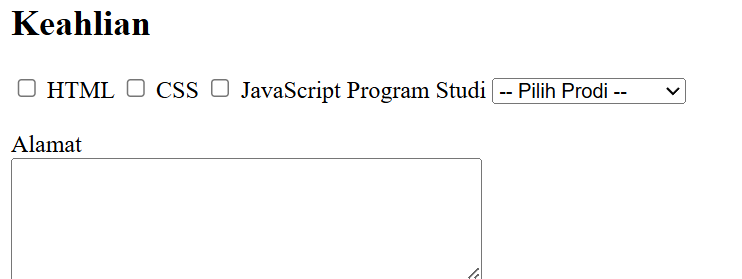

---

## 6. Validasi Form

Validasi dasar diterapkan menggunakan beberapa atribut HTML, yaitu:

- `required`
- `minlength`
- `min`
- `max`
- `type`

Validasi digunakan agar data yang dimasukkan pengguna sesuai dengan ketentuan form.

### Screenshot di VS code

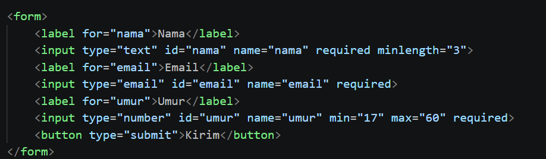

### Screenshot Hasil di Browser

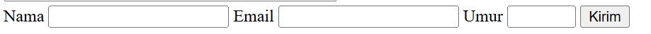

---

## 7. Semantic HTML

Semantic HTML digunakan untuk membuat struktur halaman menjadi lebih jelas.

Elemen yang digunakan:

- `<header>`
- `<nav>`
- `<main>`
- `<section>`
- `<article>`
- `<aside>`
- `<footer>`

### Screenshot di VS code

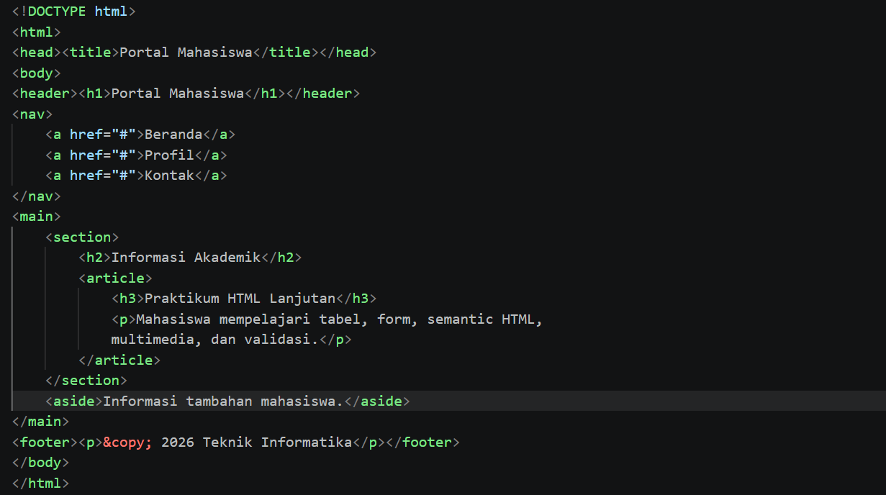

### Screenshot Hasil di Browser

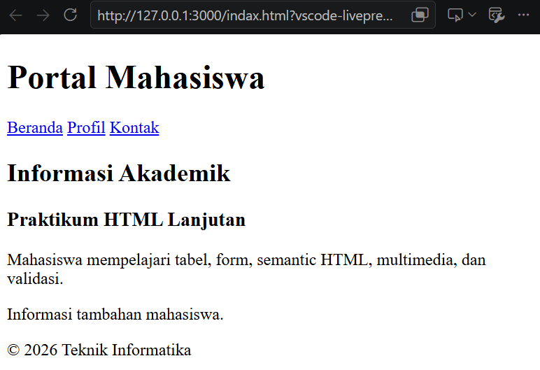

---

## 8. Multimedia

Pada praktikum ini ditambahkan elemen multimedia berupa audio dan video menggunakan:

- `<audio>`
- `<video>`

File multimedia disimpan di dalam folder `media`.

### Screenshot di VS code

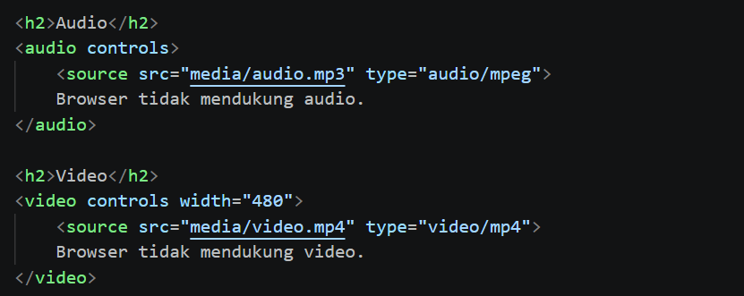

### Screenshot Hasil di Browser

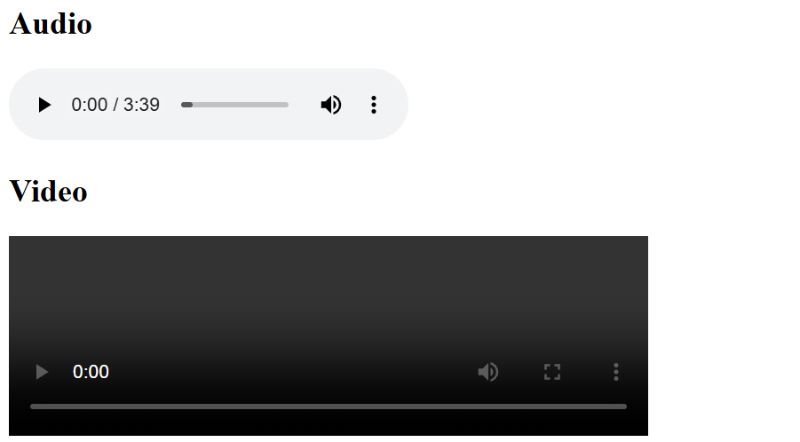

---

## 9. Proyek Mini - Biodata Mahasiswa

Proyek mini merupakan penggabungan materi yang telah dipelajari.

Halaman biodata mahasiswa menggunakan:

- Semantic HTML
- Tabel
- Form
- Input HTML
- Select
- Textarea
- Validasi form
- Multimedia

File proyek mini terdapat pada:

`biodata.html`

### Screenshot di VS code

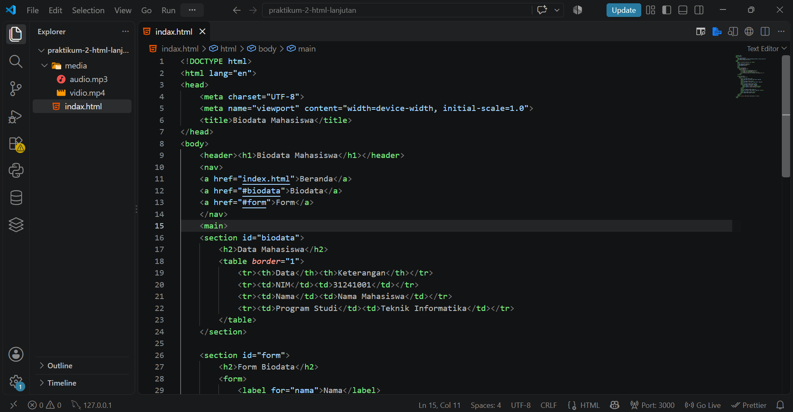

### Screenshot Hasil di Browser

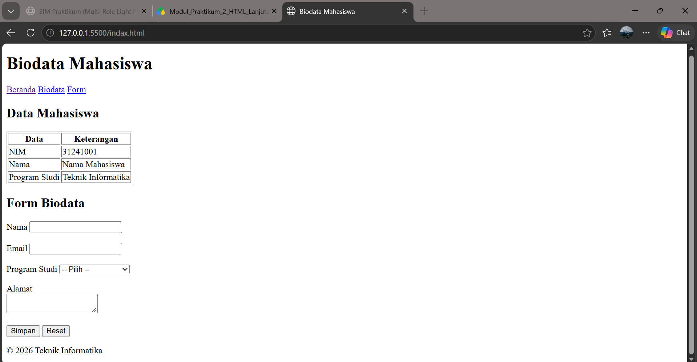

---

## Pertanyaan dan Jawaban


## Struktur Repository

```text
Lab2Web/
├── index.html
├── biodata.html
├── media/
│   ├── audio.mp3
│   └── video.mp4
├── screenshots/
└── README.md